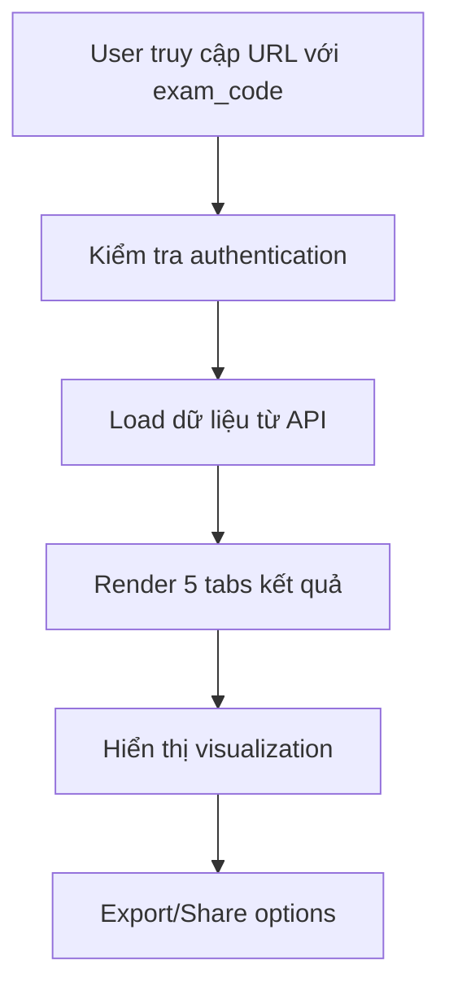

# Hệ thống Đọc và Trình bày Kết quả Trắc nghiệm Holland Code

## Tổng quan hệ thống

Hệ thống đọc kết quả trắc nghiệm được thiết kế để cung cấp phân tích chi tiết, chuyên nghiệp về tính cách nghề nghiệp theo mô hình **Holland Code (RIASEC)** cho người dùng sau khi hoàn thành bài trắc nghiệm.

## Kiến trúc hệ thống

### 1. Cấu trúc file chính

```
templates/read-test-result.html     # Giao diện chính
assets/js/read-result.js           # Logic xử lý và render kết quả  
assets/css/read-result.css         # Styling chuyên biệt
assets/img/result/                 # Hình ảnh personality groups
api/quiz/get-result.php           # API lấy dữ liệu kết quả
```

### 2. Flow hoạt động



## Chi tiết các thành phần

### 1. Xác thực và Load dữ liệu

**URL Format:**
```
read-test-result?exam_code=ABC123XYZ
```

**Authentication Flow:**
- Kiểm tra đăng nhập qua `authChecker.handleProtectedPageAccess()`
- Validate exam_code từ URL parameters
- Gọi API `api/quiz/get-result.php?exam_code=${examCode}`
- Xử lý error states (loading, not found, unauthorized)

### 2. Cấu trúc dữ liệu kết quả

**API Response Format:**
```json
{
  "status": "success",
  "data": {
    "exam_code": "ABC123XYZ",
    "created_at_formatted": "15/11/2024 14:30",
    "tendencies": {
      "R": 8.5,
      "I": 7.2,
      "A": 6.8,
      "S": 9.1,
      "E": 5.4,
      "C": 7.9
    },
    "suggested_jobs": [...]
  }
}
```

### 3. Hệ thống Tab Navigation

Giao diện được chia thành **5 tabs chính:**

#### Tab 1: Tổng quan (Overview)
- **Biểu đồ Radar Chart**: Visualization 6 nhóm Holland Code
- **Xếp hạng tính cách**: Ranking theo điểm số từ cao đến thấp
- **Personality Group Introduction**: Giới thiệu nhóm tính cách nổi bật nhất

#### Tab 2: Nhóm tính cách (Personality Groups)  
- **Top 3 nhóm tính cách**: Phân tích chi tiết 3 nhóm có điểm cao nhất
- **Đặc điểm nổi bật**: Characteristics của từng nhóm
- **Visual representation**: Sử dụng hình ảnh từ old project

#### Tab 3: Phân tích chi tiết (Detailed Analysis)
- **3 Modal cards interactives:**
  - Đặc trưng tính cách (Personality Traits)
  - Phong cách làm việc (Work Style) 
  - Hoạt động ưa thích (Preferred Activities)

#### Tab 4: Nghề phù hợp (Suggested Jobs)
- **Danh sách nghề nghiệp**: Với rating và mô tả
- **Thông tin chi tiết**: Lương, triển vọng, kỹ năng cần thiết

#### Tab 5: Hướng dẫn (Guidance)
- **Bước tiếp theo**: Roadmap phát triển sự nghiệp
- **Liên hệ tư vấn**: Call-to-action buttons

### 4. Holland Code Mapping System

**6 nhóm tính cách chính:**

| Code | Tên tiếng Việt | Tên tiếng Anh | Mô tả | Icon SVG | Image PNG |
|------|----------------|---------------|--------|----------|-----------|
| **R** | Nhà Kiến Tạo | Realistic | Thích làm việc với máy móc, công cụ | icon-kt.svg | r.png |
| **I** | Nhà Học Giả | Investigative | Thích nghiên cứu, phân tích | icon-nc.svg | i.png |
| **A** | Nhà Sáng Tạo | Artistic | Thích sáng tạo, nghệ thuật | icon-nt.svg | a.png |
| **S** | Nhà Bác Ái | Social | Thích giúp đỡ, phục vụ người khác | icon-xh.svg | s.png |
| **E** | Nhà Tiên Phong | Enterprising | Thích lãnh đạo, quản lý | icon-ql.svg | e.png |
| **C** | Nhà Tổ Chức | Conventional | Thích tổ chức, quy trình | icon-nv.svg | c.png |

## Render Logic và Data Processing

### 1. ResultViewer Class Structure

**Các phương thức chính:**

```javascript
class ResultViewer {
  // Core methods
  init()                          // Khởi tạo và load data
  loadResult()                    // API call và data processing
  
  // Rendering methods  
  renderOverview()                // Tab 1: Radar chart + ranking
  renderPersonalityGroups()       // Tab 2: Top 3 groups analysis
  renderDetailedAnalysis()        // Tab 3: Modal content generation
  renderSuggestedJobs()          // Tab 4: Jobs listing
  renderGuidance()               // Tab 5: Career guidance
  
  // Utility methods
  getGroupName(code)             // Holland code → Vietnamese name
  getGroupColor(code)            // Color scheme cho UI
  getPersonalityGroupImage(code) // PNG images từ old project
  getPersonalityGroupSvgIcon(code) // SVG icons từ old project
}
```

### 2. Data Visualization

**Radar Chart (Chart.js):**
```javascript
// Cấu hình radar chart cho 6 nhóm Holland Code
new Chart(ctx, {
  type: 'radar',
  data: {
    labels: ['Kỹ thuật', 'Nghiên cứu', 'Nghệ thuật', 'Xã hội', 'Quản lý', 'Nghiệp vụ'],
    datasets: [{
      data: [R_score, I_score, A_score, S_score, E_score, C_score],
      backgroundColor: 'rgba(150, 75, 223, 0.2)',
      borderColor: 'rgba(150, 75, 223, 1)'
    }]
  }
})
```

**Tendency Ranking:**
- Sort theo điểm số từ cao đến thấp
- Progress bars với gradient colors
- Animation delays cho smooth loading

### 3. Modal System Architecture

**3 Modal chuyên biệt:**

#### Modal 1: Personality Traits
```javascript
renderPersonalityTraits(topTendencies) {
  // Hiển thị:
  // - Top personality groups với scores
  // - Điểm mạnh (strengths) cho mỗi group  
  // - Cơ hội phát triển (development areas)
  // - Expert advice section
}
```

#### Modal 2: Work Style
```javascript  
renderWorkStyle(topTendencies) {
  // Hiển thị:
  // - Môi trường làm việc ưa thích
  // - Cách tiếp cận công việc
  // - Phong cách quản lý
  // - Tính chất công việc phù hợp
}
```

#### Modal 3: Preferred Activities
```javascript
renderPreferredActivities(topTendencies) {
  // Hiển thị:
  // - Hoạt động yêu thích
  // - Môi trường học tập
  // - Hoạt động giải trí
  // - Định hướng hoạt động
}
```

## UI/UX Design Principles

### 1. Visual Hierarchy
- **Primary colors**: PAC Purple (#964bdf) + Yellow (#fff200)
- **Typography**: Montserrat font family
- **Spacing**: Consistent 8px grid system
- **Cards**: 16px border-radius, subtle shadows

### 2. Progressive Disclosure
- **Tab navigation**: Phân chia nội dung thành chunks dễ tiêu thụ
- **Modal system**: Deep-dive analysis on demand
- **AOS animations**: Smooth reveal cho better UX

### 3. Responsive Design
- **Bootstrap 5 grid**: Mobile-first approach
- **Breakpoints**: sm, md, lg responsive behaviors
- **Touch-friendly**: Button sizes và spacing cho mobile

### 4. Accessibility
- **ARIA labels**: Screen reader support
- **Keyboard navigation**: Tab focus management
- **Color contrast**: WCAG 2.1 AA compliance
- **Alt texts**: Cho tất cả images

## Advanced Features

### 1. Export System
```javascript
// PDF Export (Planned)
document.getElementById('export-pdf-btn').addEventListener('click', () => {
  // TODO: Implement client-side PDF generation
  // Using libraries như jsPDF hoặc Puppeteer
});

// Share functionality
navigator.share({
  title: 'Kết quả trắc nghiệm tính cách nghề nghiệp',
  url: window.location.href
});
```

### 2. Error Handling
- **Network errors**: Retry mechanisms với exponential backoff
- **Data validation**: Comprehensive input sanitization
- **Graceful degradation**: Fallback states cho missing data
- **User feedback**: Toast notifications cho actions

### 3. Performance Optimization
- **Lazy loading**: Images và heavy content
- **Debounced animations**: Smooth performance on slower devices
- **Efficient DOM manipulation**: Minimal reflows/repaints
- **Caching strategy**: LocalStorage cho static content

## Data Analysis Logic

### 1. Scoring Algorithm
```javascript
// Tính toán top personality groups
const topGroups = Object.entries(tendencies)
  .sort(([,a], [,b]) => b - a)  // Sort descending
  .slice(0, 3);                 // Top 3 nhóm

// Percentage calculation cho progress bars
const percent = Math.max((score / 10) * 100, 5); // Min 5% visibility
```

### 2. Content Generation
```javascript
// Dynamic content based on personality codes
getPersonalityStrengths(code) {
  const strengths = {
    'R': ['Thực tế và có khả năng giải quyết vấn đề', ...],
    'I': ['Tư duy phân tích và logic mạnh', ...],
    // ... mapping cho tất cả 6 codes
  };
  return strengths[code] || [];
}
```

### 3. Job Matching System
```javascript
// Render suggested jobs với compatibility scoring
jobs.map(job => ({
  name: job.job_title,
  compatibility: job.compatibility_score,
  salary: job.average_salary,
  prospects: job.growth_prospect
}));
```

## Integration Points

### 1. Backend API Dependencies
- **Authentication API**: User session validation
- **Quiz Result API**: `get-result.php` endpoint
- **User Profile API**: Cho export metadata

### 2. Frontend Component Integration
- **Header/Footer**: Component loader system
- **Auth System**: `authen.js` integration
- **Toast System**: `toastbar.js` cho notifications

### 3. Third-party Libraries
- **Chart.js**: Radar chart visualization
- **Bootstrap 5**: UI framework
- **AOS**: Animation on scroll
- **FontAwesome**: Icon system

## Maintenance và Monitoring

### 1. Performance Metrics
- **Page load time**: Target < 3 seconds
- **API response time**: Monitor endpoint performance
- **User engagement**: Track tab navigation patterns
- **Error rates**: Monitor JavaScript console errors

### 2. Content Updates
- **Personality descriptions**: Easily updatable in JavaScript
- **Job database**: Sync với backend job data
- **Visual assets**: Maintain image optimization

### 3. Browser Compatibility
- **Modern browsers**: Chrome 90+, Firefox 88+, Safari 14+
- **Mobile browsers**: iOS Safari, Chrome Mobile
- **Graceful degradation**: Basic functionality cho older browsers

## Troubleshooting Guide

### Các lỗi thường gặp:

1. **"Exam code not found"**
   - Check URL parameter format
   - Verify database có record tương ứng

2. **"Authentication failed"** 
   - Check user session status
   - Verify authChecker.js configuration

3. **"Charts not rendering"**
   - Verify Chart.js library loaded
   - Check canvas element existence

4. **"Images not loading"**
   - Verify file paths trong assets/img/result/
   - Check web server static file serving

## Future Enhancements

### 1. Advanced Analytics
- **Detailed tracking**: User interaction heatmaps
- **A/B testing**: Different presentation formats
- **Comparative analysis**: Benchmark với population data

### 2. Enhanced Export
- **PDF generation**: Client-side hoặc server-side
- **Email sharing**: Direct result sharing
- **Print optimization**: CSS print styles

### 3. Personalization
- **Saved preferences**: UI customization
- **Historical comparison**: Multiple test results
- **Custom recommendations**: AI-powered suggestions

---

## Kết luận

Hệ thống đọc kết quả trắc nghiệm được thiết kế để cung cấp trải nghiệm professional, insightful và user-friendly cho việc hiểu rõ tính cách nghề nghiệp theo mô hình Holland Code. Với architecture modular và responsive design, hệ thống có thể dễ dàng maintain và extend trong tương lai.

Việc integration các visual assets từ old project đảm bảo tính consistency và professional appearance, trong khi modern JavaScript practices đảm bảo performance và maintainability tốt.