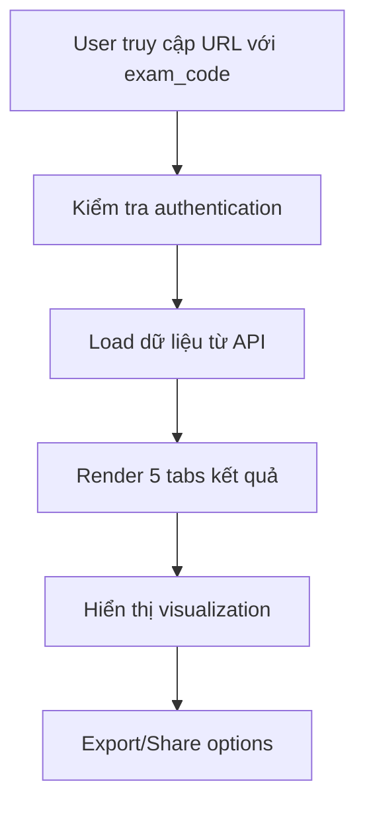

# Hệ thống Đọc và Trình bày Kết quả Trắc nghiệm Holland Code

## Tổng quan hệ thống

Hệ thống đọc kết quả trắc nghiệm được thiết kế để cung cấp phân tích chi tiết, chuyên nghiệp về tính cách nghề nghiệp theo mô hình **Holland Code (RIASEC)** cho người dùng sau khi hoàn thành bài trắc nghiệm.

## Kiến trúc hệ thống

### 1. Cấu trúc file chính

```
templates/read-test-result.html     # Giao diện chính
assets/js/read-result.js           # Logic xử lý và render kết quả  
assets/css/read-result.css         # Styling chuyên biệt
assets/img/result/                 # Hình ảnh personality groups
api/quiz/get-result.php           # API lấy dữ liệu kết quả
```

### 2. Flow hoạt động



## Chi tiết các thành phần

### 1. Xác thực và Load dữ liệu

**URL Format:**
```
read-test-result?exam_code=ABC123XYZ
```

**Authentication Flow:**
- Kiểm tra đăng nhập qua `authChecker.handleProtectedPageAccess()`
- Validate exam_code từ URL parameters
- Gọi API `api/quiz/get-result.php?exam_code=${examCode}`
- Xử lý error states (loading, not found, unauthorized)

### 2. Cấu trúc dữ liệu kết quả

**API Response Format (Enhanced với Career Suggestions):**
```json
{
  "status": "success",
  "data": {
    "exam_code": "ABC123XYZ",
    "created_at_formatted": "15/11/2024 14:30",
    "holland_code": "IRA",
    "tendencies": {
      "R": 8.5,
      "I": 7.2,
      "A": 6.8,
      "S": 9.1,
      "E": 5.4,
      "C": 7.9
    },
    "suggested_jobs": [
      {
        "job_title": "Kỹ sư Phần mềm",
        "description": "Phát triển ứng dụng và hệ thống phần mềm",
        "compatibility_score": 5,
        "matching_tier": "5⭐",
        "holland_code_match": "IRA",
        "average_salary": "15-30 triệu",
        "growth_prospect": "Rất tốt",
        "required_skills": "Lập trình, Tư duy logic, Sáng tạo",
        "work_environment": "Văn phòng, Remote work",
        "education_level": "Đại học",
        "match_type": "exact",
        "priority_score": 95
      }
    ],
    "career_analysis": {
      "algorithm_version": "4-tier-permutation",
      "total_jobs_analyzed": 25,
      "matching_tiers": {
        "5_star": 3,
        "4_star": 8,
        "3_star": 10,
        "2_star": 4
      },
      "holland_code_used": "IRA"
    }
  }
}
```

### 3. Hệ thống Tab Navigation

Giao diện được chia thành **5 tabs chính:**

#### Tab 1: Tổng quan (Overview)
- **Biểu đồ Radar Chart**: Visualization 6 nhóm Holland Code
- **Xếp hạng tính cách**: Ranking theo điểm số từ cao đến thấp
- **Personality Group Introduction**: Giới thiệu nhóm tính cách nổi bật nhất

#### Tab 2: Nhóm tính cách (Personality Groups)  
- **Top 3 nhóm tính cách**: Phân tích chi tiết 3 nhóm có điểm cao nhất
- **Đặc điểm nổi bật**: Characteristics của từng nhóm
- **Visual representation**: Sử dụng hình ảnh từ old project

#### Tab 3: Phân tích chi tiết (Detailed Analysis)
- **3 Modal cards interactives:**
  - Đặc trưng tính cách (Personality Traits)
  - Phong cách làm việc (Work Style) 
  - Hoạt động ưa thích (Preferred Activities)

#### Tab 4: Nghề phù hợp (Suggested Jobs) - Enhanced 2024
- **Single-column Layout**: Mỗi job card chiếm full width cho detailed content
- **4-Tier Matching System**: 5⭐ (exact) → 4⭐ (permutation) → 3⭐ (two-char) → 2⭐ (single-char)
- **Progressive Disclosure**: Collapsible sections cho detailed job information
- **Normalized Compatibility Score**: Multi-scale input support (0-5, 0-10, 0-100)
- **Enhanced Job Cards**: 
  - PAC-branded styling với hover animations
  - Detailed abilities, work environment, specializations
  - Consistent star rating system
  - Education level text conversion
- **Match Type Indicators**: Hiển thị loại match (exact, permutation, two_char, single_char)
- **Priority Scoring**: Sắp xếp theo độ phù hợp và ưu tiên
- **Career Analysis**: Thống kê về thuật toán matching và số lượng công việc phân tích

#### Tab 5: Hướng dẫn (Guidance)
- **Bước tiếp theo**: Roadmap phát triển sự nghiệp
- **Liên hệ tư vấn**: Call-to-action buttons

### 4. Holland Code Mapping System

**6 nhóm tính cách chính:**

| Code | Tên tiếng Việt | Tên tiếng Anh | Mô tả | Icon SVG | Image PNG |
|------|----------------|---------------|--------|----------|-----------|
| **R** | Nhà Kiến Tạo | Realistic | Thích làm việc với máy móc, công cụ | icon-kt.svg | r.png |
| **I** | Nhà Học Giả | Investigative | Thích nghiên cứu, phân tích | icon-nc.svg | i.png |
| **A** | Nhà Sáng Tạo | Artistic | Thích sáng tạo, nghệ thuật | icon-nt.svg | a.png |
| **S** | Nhà Bác Ái | Social | Thích giúp đỡ, phục vụ người khác | icon-xh.svg | s.png |
| **E** | Nhà Tiên Phong | Enterprising | Thích lãnh đạo, quản lý | icon-ql.svg | e.png |
| **C** | Nhà Tổ Chức | Conventional | Thích tổ chức, quy trình | icon-nv.svg | c.png |

## Render Logic và Data Processing

### 1. ResultViewer Class Structure

**Các phương thức chính:**

```javascript
class ResultViewer {
  // Core methods
  init()                          // Khởi tạo và load data
  loadResult()                    // API call và data processing
  
  // Rendering methods  
  renderOverview()                // Tab 1: Radar chart + ranking
  renderPersonalityGroups()       // Tab 2: Top 3 groups analysis
  renderDetailedAnalysis()        // Tab 3: Modal content generation
  renderSuggestedJobs()          // Tab 4: Jobs listing
  renderGuidance()               // Tab 5: Career guidance
  
  // Utility methods
  getGroupName(code)             // Holland code → Vietnamese name
  getGroupColor(code)            // Color scheme cho UI
  getPersonalityGroupImage(code) // PNG images từ old project
  getPersonalityGroupSvgIcon(code) // SVG icons từ old project
}
```

### 2. Data Visualization

**Radar Chart (Chart.js):**
```javascript
// Cấu hình radar chart cho 6 nhóm Holland Code
new Chart(ctx, {
  type: 'radar',
  data: {
    labels: ['Kỹ thuật', 'Nghiên cứu', 'Nghệ thuật', 'Xã hội', 'Quản lý', 'Nghiệp vụ'],
    datasets: [{
      data: [R_score, I_score, A_score, S_score, E_score, C_score],
      backgroundColor: 'rgba(150, 75, 223, 0.2)',
      borderColor: 'rgba(150, 75, 223, 1)'
    }]
  }
})
```

**Tendency Ranking:**
- Sort theo điểm số từ cao đến thấp
- Progress bars với gradient colors
- Animation delays cho smooth loading

### 3. Modal System Architecture

**3 Modal chuyên biệt:**

#### Modal 1: Personality Traits
```javascript
renderPersonalityTraits(topTendencies) {
  // Hiển thị:
  // - Top personality groups với scores
  // - Điểm mạnh (strengths) cho mỗi group  
  // - Cơ hội phát triển (development areas)
  // - Expert advice section
}
```

#### Modal 2: Work Style
```javascript  
renderWorkStyle(topTendencies) {
  // Hiển thị:
  // - Môi trường làm việc ưa thích
  // - Cách tiếp cận công việc
  // - Phong cách quản lý
  // - Tính chất công việc phù hợp
}
```

#### Modal 3: Preferred Activities
```javascript
renderPreferredActivities(topTendencies) {
  // Hiển thị:
  // - Hoạt động yêu thích
  // - Môi trường học tập
  // - Hoạt động giải trí
  // - Định hướng hoạt động
}
```

## UI/UX Design Principles

### 1. Visual Hierarchy
- **Primary colors**: PAC Purple (#964bdf) + Yellow (#fff200)
- **Typography**: Montserrat font family
- **Spacing**: Consistent 8px grid system
- **Cards**: 16px border-radius, subtle shadows

### 2. Progressive Disclosure
- **Tab navigation**: Phân chia nội dung thành chunks dễ tiêu thụ
- **Modal system**: Deep-dive analysis on demand
- **AOS animations**: Smooth reveal cho better UX

### 3. Responsive Design
- **Bootstrap 5 grid**: Mobile-first approach
- **Breakpoints**: sm, md, lg responsive behaviors
- **Touch-friendly**: Button sizes và spacing cho mobile

### 4. Accessibility
- **ARIA labels**: Screen reader support
- **Keyboard navigation**: Tab focus management
- **Color contrast**: WCAG 2.1 AA compliance
- **Alt texts**: Cho tất cả images

## UI/UX Enhancements 2024 (Latest Updates)

### 1. Job Cards Layout Optimization

**Single-Column Layout:**
- Chuyển từ 2-column (`col-lg-6`) sang single-column (`col-12`) layout
- Tối ưu cho việc hiển thị thông tin chi tiết nhiều
- Cải thiện readability trên cả desktop và mobile

**Enhanced Job Card Structure:**
```html
<div class="col-12 mb-4" data-aos="fade-up">
  <div class="job-card h-100">
    <!-- Job Header with title, badges, compatibility rating -->
    <!-- Collapsible sections for detailed information -->
    <!-- PAC-branded styling with enhanced animations -->
  </div>
</div>
```

### 2. Collapsible Content Sections

**Progressive Disclosure cho Job Details:**
- **Năng lực cần thiết**: Capacity, Essential & Supplementary abilities
- **Môi trường & Nơi làm việc**: Work environment, work areas
- **Phong cách & Giá trị làm việc**: Work style, work values
- **Chuyên môn chi tiết**: Specializations với numbered list
- **Nhiệm vụ chính**: Main tasks với checklist design

**Interactive Toggle System:**
```javascript
setupJobCardCollapse() {
  // Event listeners cho collapsible sections
  // Icon rotation animation (0deg ↔ 180deg)
  // Smooth expand/collapse transitions
}
```

### 3. Compatibility Score Normalization

**Multi-Scale Support:**
```javascript
normalizeCompatibilityScore(score) {
  // Supports 0-5, 0-10, 0-100 input scales
  // Normalizes to consistent 0-5 display scale
  // Rounds to 1 decimal place for clean display
}
```

**Consistent Star Rating System:**
- **5 stars**: Exact match với filled/empty star logic
- **Dynamic scoring**: Automatic adaptation to input scale
- **Visual consistency**: Stars match displayed numerical score

### 4. Education Level Text Enhancement

**Smart Text Conversion:**
```javascript
getEducationLevelText(level) {
  // Input: Numeric (1-5), String codes, Vietnamese text
  // Output: Standardized Vietnamese education levels
  // Mapping: 1→"Tiểu học", 5→"Đại học trở lên", etc.
}
```

**Supported Input Formats:**
- Numeric: `1`, `2`, `3`, `4`, `5`
- String codes: `"university"`, `"college"`, `"high_school"`
- Vietnamese text: Direct Vietnamese education level names

### 5. Enhanced Tier Header Visibility

**Improved Text Readability:**
```css
.tier-header h4 {
  text-shadow: 0 2px 4px rgba(0, 0, 0, 0.3);
  font-weight: 800;
  z-index: 2;
}

.tier-header p {
  text-shadow: 0 1px 3px rgba(0, 0, 0, 0.3);
  color: white;
  opacity: 0.95;
}
```

**Visual Enhancements:**
- **Text shadows**: Improved contrast against gradient backgrounds
- **Z-index layering**: Text always above background effects
- **Reduced background noise**: Smaller, more transparent accent elements
- **Mobile optimization**: Enhanced shadows và sizing cho smaller screens

### 6. Custom Color System

**PAC Success Color (`text-pac-success`):**
```css
.text-pac-success {
  color: #10b981 !important; /* Bright emerald green */
}
.text-pac-success:hover {
  color: #059669 !important; /* Darker green on hover */
}
```

**Color Comparison:**
- **Bootstrap default**: `text-success` (#198754) - dark, hard to read
- **PAC enhanced**: `text-pac-success` (#10b981) - bright, high contrast

**Usage Locations:**
- Personality characteristics check icons
- Job statistics numbers (5-star jobs count)
- Tier headers for "Rất phù hợp" categories

### 7. PAC Brand Integration

**Enhanced CSS Framework:**
```css
/* PAC Brand Colors */
:root {
  --brand-primary: #964bdf;
  --brand-secondary: #5d2e8b;
  --brand-accent: #fff200;
}

/* Job Card Styling */
.job-card {
  box-shadow: 0 4px 20px rgba(150, 75, 223, 0.08);
  border: 1px solid rgba(150, 75, 223, 0.1);
  transition: all 0.4s cubic-bezier(0.4, 0, 0.2, 1);
}

.job-card:hover {
  transform: translateY(-4px);
  box-shadow: 0 12px 40px rgba(150, 75, 223, 0.15);
}
```

**Animation System:**
```css
@keyframes pac-glow {
  0%, 100% { box-shadow: 0 4px 20px rgba(150, 75, 223, 0.15); }
  50% { box-shadow: 0 8px 30px rgba(150, 75, 223, 0.25); }
}

@keyframes pac-pulse {
  0%, 100% { transform: scale(1); }
  50% { transform: scale(1.05); }
}
```

### 8. Enhanced Data Processing

**JSON Array Parser:**
```javascript
parseJsonArray(jsonString) {
  // Handles both JSON arrays and delimited strings
  // Supports comma, semicolon, pipe delimiters
  // Graceful error handling với fallback
}
```

**Compatibility Score Badges:**
```javascript
// Dynamic badge assignment based on normalized score
${displayScore >= 5 ? 'Rất phù hợp' : 
  displayScore >= 4 ? 'Phù hợp tốt' : 'Có tiềm năng'}
```

### 9. Progressive Job Display System

**Tiered Revelation:**
- **5⭐ jobs**: Always visible by default
- **4⭐ jobs**: Hidden initially, "Xem thêm" button
- **3-2⭐ jobs**: Hidden initially, second "Xem thêm" button
- **Smooth scrolling**: Auto-scroll to newly revealed content

**Show More Buttons:**
```javascript
showMoreJobs(tier) {
  // Show appropriate tier
  // Hide current show-more button
  // Display next tier button if available
  // Smooth scroll to new content
}
```

## Advanced Features

### 1. Export System
```javascript
// PDF Export (Planned)
document.getElementById('export-pdf-btn').addEventListener('click', () => {
  // TODO: Implement client-side PDF generation
  // Using libraries như jsPDF hoặc Puppeteer
});

// Share functionality
navigator.share({
  title: 'Kết quả trắc nghiệm tính cách nghề nghiệp',
  url: window.location.href
});
```

### 2. Error Handling
- **Network errors**: Retry mechanisms với exponential backoff
- **Data validation**: Comprehensive input sanitization
- **Graceful degradation**: Fallback states cho missing data
- **User feedback**: Toast notifications cho actions

### 3. Performance Optimization
- **Lazy loading**: Images và heavy content
- **Debounced animations**: Smooth performance on slower devices
- **Efficient DOM manipulation**: Minimal reflows/repaints
- **Caching strategy**: LocalStorage cho static content

## Data Analysis Logic

### 1. Scoring Algorithm
```javascript
// Tính toán top personality groups
const topGroups = Object.entries(tendencies)
  .sort(([,a], [,b]) => b - a)  // Sort descending
  .slice(0, 3);                 // Top 3 nhóm

// Percentage calculation cho progress bars
const percent = Math.max((score / 10) * 100, 5); // Min 5% visibility
```

### 2. Content Generation
```javascript
// Dynamic content based on personality codes
getPersonalityStrengths(code) {
  const strengths = {
    'R': ['Thực tế và có khả năng giải quyết vấn đề', ...],
    'I': ['Tư duy phân tích và logic mạnh', ...],
    // ... mapping cho tất cả 6 codes
  };
  return strengths[code] || [];
}
```

### 3. Enhanced Job Matching System (2024 Updates)
```javascript
// Enhanced job rendering với sophisticated matching info
renderSuggestedJobs(jobs, careerAnalysis) {
  jobs.map(job => {
    // Normalize compatibility score for consistent display
    const displayScore = this.normalizeCompatibilityScore(job.compatibility_score);
    
    return {
      name: job.job_title,
      compatibility: displayScore, // Normalized 0-5 scale
      matchingTier: job.matching_tier, // 5⭐, 4⭐, 3⭐, 2⭐
      matchType: job.match_type, // exact, permutation, two_char, single_char
      hollandCodeMatch: job.holland_code_match,
      salary: job.average_salary,
      prospects: job.growth_prospect,
      skills: job.required_skills,
      workEnvironment: job.work_environment,
      educationLevel: this.getEducationLevelText(job.education_level), // Converted text
      priorityScore: job.priority_score,
      // Enhanced fields for detailed display
      capacity: job.capacity,
      essential_ability: job.essential_ability,
      supplementary_ability: job.supplementary_ability,
      work_areas: job.work_areas,
      work_style: job.work_style,
      work_value: job.work_value,
      specializations: job.specializations,
      main_tasks: job.main_tasks
    };
  });
  
  // Display career analysis insights
  displayCareerAnalysis(careerAnalysis);
}

// Enhanced job card rendering with collapsible sections
renderJobCards(jobs) {
  return jobs.map((job, index) => {
    const displayScore = this.normalizeCompatibilityScore(job.compatibility_score);
    
    return `
      <div class="col-12 mb-4" data-aos="fade-up" data-aos-delay="${index * 100}">
        <div class="job-card h-100">
          <!-- Job header with PAC branding -->
          <!-- Normalized compatibility score và star rating -->
          <!-- Collapsible sections for detailed info -->
          <!-- Enhanced styling với hover effects -->
        </div>
      </div>
    `;
  }).join('');
}

// Career analysis display
displayCareerAnalysis(analysis) {
  // Show algorithm version: 4-tier-permutation
  // Display total jobs analyzed
  // Show distribution across matching tiers
  // Highlight Holland Code used for matching
}
```

### 4. Advanced UI Components (2024 Enhancements)

**Collapsible Job Sections:**
```javascript
// Setup collapse functionality
setupJobCardCollapse() {
  document.addEventListener('click', function(e) {
    if (e.target.closest('.section-toggle')) {
      const toggle = e.target.closest('.section-toggle');
      const icon = toggle.querySelector('.toggle-icon');
      
      // Animated icon rotation
      setTimeout(() => {
        const collapseElement = document.querySelector(target);
        if (collapseElement.classList.contains('show')) {
          icon.style.transform = 'rotate(180deg)';
        } else {
          icon.style.transform = 'rotate(0deg)';
        }
      }, 10);
    }
  });
}
```

**Enhanced CSS Styling System:**
```javascript
addJobCardStyles() {
  const css = `
    /* PAC-branded job cards with enhanced animations */
    .job-card {
      background: #fff;
      border-radius: 16px;
      box-shadow: 0 4px 20px rgba(150, 75, 223, 0.08);
      transition: all 0.4s cubic-bezier(0.4, 0, 0.2, 1);
    }
    
    /* Custom success color for better visibility */
    .text-pac-success {
      color: #10b981 !important;
    }
    
    /* Enhanced tier headers với improved readability */
    .tier-header h4 {
      text-shadow: 0 2px 4px rgba(0, 0, 0, 0.3);
      font-weight: 800;
    }
  `;
  
  // Dynamic style injection với cache busting
  const style = document.createElement('style');
  style.id = 'enhanced-job-cards-styles';
  style.textContent = css;
  document.head.appendChild(style);
}
```

## Integration Points

### 1. Backend API Dependencies
- **Authentication API**: User session validation
- **Enhanced Quiz Result API**: `get-result.php` endpoint với CareerSuggestionEngine integration
- **Career Suggestion Engine**: 4-tier permutation matching algorithm
- **Jobs Database**: 200+ nghề nghiệp với Holland Code mapping
- **User Profile API**: Cho export metadata

### 2. Frontend Component Integration
- **Header/Footer**: Component loader system
- **Auth System**: `authen.js` integration
- **Toast System**: `toastbar.js` cho notifications

### 3. Third-party Libraries
- **Chart.js**: Radar chart visualization
- **Bootstrap 5**: UI framework
- **AOS**: Animation on scroll
- **FontAwesome**: Icon system

## Maintenance và Monitoring

### 1. Performance Metrics
- **Page load time**: Target < 3 seconds
- **API response time**: Monitor endpoint performance
- **User engagement**: Track tab navigation patterns
- **Error rates**: Monitor JavaScript console errors

### 2. Content Updates
- **Personality descriptions**: Easily updatable in JavaScript
- **Job database**: Sync với backend job data
- **Visual assets**: Maintain image optimization

### 3. Browser Compatibility
- **Modern browsers**: Chrome 90+, Firefox 88+, Safari 14+
- **Mobile browsers**: iOS Safari, Chrome Mobile
- **Graceful degradation**: Basic functionality cho older browsers

## Troubleshooting Guide

### Các lỗi thường gặp:

1. **"Exam code not found"**
   - Check URL parameter format
   - Verify database có record tương ứng

2. **"Authentication failed"** 
   - Check user session status
   - Verify authChecker.js configuration

3. **"Charts not rendering"**
   - Verify Chart.js library loaded
   - Check canvas element existence

4. **"Images not loading"**
   - Verify file paths trong assets/img/result/
   - Check web server static file serving

## Changelog - November 2024

### Version 2.1.0 - UI/UX Enhancement Release

**🎨 Major UI/UX Improvements:**
- **Single-column job cards**: Improved readability cho detailed job information
- **Collapsible content sections**: Progressive disclosure cho job details
- **Enhanced PAC branding**: Consistent color scheme và animations
- **Improved text visibility**: Custom success colors và enhanced tier headers
- **Responsive design upgrades**: Better mobile experience

**📊 Data Processing Enhancements:**
- **Multi-scale compatibility score support**: 0-5, 0-10, 0-100 input handling
- **Education level text conversion**: Smart mapping từ numbers sang Vietnamese text
- **JSON array parsing**: Robust handling of various data formats
- **Normalized star rating system**: Consistent 5-star display logic

**🔧 Technical Improvements:**
- **Enhanced error handling**: Graceful degradation và fallbacks
- **Performance optimizations**: Efficient DOM manipulation
- **CSS architecture**: Modular styling với cache busting
- **Accessibility improvements**: Better contrast và screen reader support

**📱 Mobile-First Enhancements:**
- **Touch-optimized interactions**: Collapsible sections
- **Responsive typography**: Enhanced readability across devices
- **Mobile-specific animations**: Optimized performance
- **Progressive enhancement**: Core functionality on all devices

### Version 2.0.0 - Career Suggestion Integration
- **4-tier matching algorithm**: Enhanced job recommendations
- **Career analysis insights**: Detailed statistics và algorithm transparency
- **Job database integration**: 200+ nghề nghiệp với Holland Code mapping
- **Advanced filtering**: Multi-criteria job matching

### Version 1.5.0 - Visual Enhancement Release
- **PAC brand integration**: Corporate color scheme
- **Enhanced animations**: AOS integration và custom animations
- **Modal system**: Deep-dive analysis components
- **Responsive grid**: Bootstrap 5 optimization

## Future Enhancements

### 1. Advanced Analytics
- **Detailed tracking**: User interaction heatmaps
- **A/B testing**: Different presentation formats
- **Comparative analysis**: Benchmark với population data

### 2. Enhanced Export
- **PDF generation**: Client-side hoặc server-side
- **Email sharing**: Direct result sharing
- **Print optimization**: CSS print styles

### 3. Personalization
- **Saved preferences**: UI customization
- **Historical comparison**: Multiple test results
- **Custom recommendations**: AI-powered suggestions

### 4. Accessibility & Performance
- **WCAG 2.1 AAA compliance**: Enhanced accessibility features
- **PWA capabilities**: Offline support và caching
- **Micro-interactions**: Advanced animation system
- **Dark mode support**: Theme switching capabilities

---

## Kết luận

Hệ thống đọc kết quả trắc nghiệm đã được nâng cấp đáng kể trong năm 2024 với focus vào user experience và visual design. Việc chuyển sang single-column layout, enhanced PAC branding, và progressive disclosure system đã cải thiện significantly việc presentation và consumption của career analysis data.

Với architecture modular và responsive design, hệ thống không chỉ maintain được compatibility với existing features mà còn provide foundation mạnh mẽ cho future enhancements. Việc integration của advanced data processing capabilities với modern UI/UX principles tạo ra một experience vừa professional vừa user-friendly.

**Key Achievements 2024:**
- ✅ Enhanced readability và visual hierarchy
- ✅ PAC brand consistency across all components  
- ✅ Mobile-optimized responsive design
- ✅ Advanced data normalization và processing
- ✅ Modular CSS architecture với performance optimization
- ✅ Accessibility improvements và cross-browser compatibility

Hệ thống hiện tại đã sẵn sàng để serve users với high-quality career analysis experience và có thể easily scale cho future feature additions.